# agent-charts

Inline charts for coding agents in the terminal: a plugin for the [OpenCode](https://opencode.ai) v2 TUI and another for [Claude Code](https://claude.com/claude-code), sharing one chart engine. Ask your agent for a chart and it draws it right in the conversation, using braille dots, eighth blocks and half-block pixels on the terminal grid. There are no images, no external tools and no runtime dependencies, so it works over SSH too.

(Formerly `opencode-charts`; the old GitHub URLs redirect here.)

The model writes a JSON spec in a fenced ` ```chart ` block:

````
```chart
{"type":"line","title":"Inflation vs Fed target (YoY %)","unit":"%",
 "series":[{"name":"CPI","data":[["2024-01",3.1],["2024-02",3.2],…]},{"name":"Core","data":[…]}],
 "refs":[{"y":2,"label":"target"}]}
```
````

and the plugin paints it inside a card that follows your theme (dark or light):

<p align="center">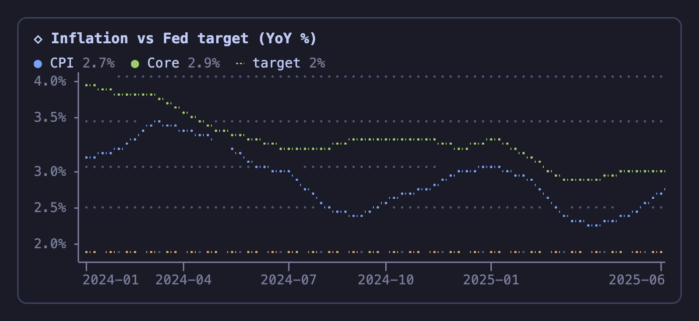</p>

## Install

### Claude Code

At the prompt of a Claude Code session:

```
/plugin install charts --marketplace hashd1ve/agent-charts
```

Answer `y` to add the marketplace, then pick a scope. The plugin draws ```` ```chart ```` blocks in Claude's replies (in the terminal; other surfaces show the JSON as code) and adds the chart cheat sheet to the system prompt, so Claude knows the format. Colors map onto Claude Code's theme keys (`claude`, `success`, `error`, `subtle`…), so charts follow `/theme`.

### OpenCode

1. Clone the repo and copy the plugin into your OpenCode config:

   ```sh
   git clone https://github.com/hashd1ve/agent-charts && cd agent-charts
   bun scripts/install.ts            # → ~/.config/opencode/plugins/charts (backs up any previous copy)
   ```

2. List it in `~/.config/opencode/cli.json`:

   ```json
   { "plugins": ["~/.config/opencode/plugins/charts"] }
   ```

3. Restart OpenCode. Running TUIs hot-reload the plugin when its files change.

There's nothing to `npm install`. At runtime the plugin only uses modules that the OpenCode host already provides.

## Chart types

| type | data | good for |
|---|---|---|
| `line` | `"data":[["2024-01",4.1],…]` or `"series":[{"name","data"},…]` | time series, trends, comparisons |
| `area` | like `line`, filled with a dithered gradient; several series + `"stacked":true` / `"percent":true` stack them | one series with a clear shape, composition over time |
| `drawdown` | prices, as for `line` | % fall from the running peak (max drawdown, its peak, where it is now) |
| `step` | like `line`, value holds until the next point | policy rates, thresholds, tiers |
| `scatter` | `"data":[[x,y],…]` | correlation (`"trend":true` adds a regression line and r²) |
| `bar` | `"data":{"A":450,"B":320}` | ranking and comparison; negatives diverge from zero |
| `column` | same as `bar` | monthly or quarterly values, with value labels on top |
| `hist` | `"data":[raw values]`, `"bins"` | distributions (footer shows n, mean, median, σ) |
| `heat` | `"xLabels","yLabels","z":[[row],…]` or `"data":[[x,y,v],…]` | matrices; mixed signs use a diverging scale (monthly returns) |
| `calendar` | `"data":[["2026-03-01",v],…]` | daily activity, GitHub-style |
| `candle` | `"data":[[date,o,h,l,c,volume?],…]` | OHLC with an optional volume pane |
| `pie` / `donut` | `"data":{"A":60,"B":40}` | composition (more than 8 slices collapse into "Other"; `"aspect"` tunes roundness, default 1.15) |
| `gauge` | `"data":{"CPU":72}`, `"max"`, `"thresholds"`, `"target"` | progress, bullet charts |
| `stat` | `"data":[{"label","value","change","spark"},…]` | KPI tiles: value, colored change (`"lowerIsBetter"` flips it), sparkline |
| `dumbbell` | `"labels":["2023","2025"],"data":[["Fed",5.5,4.5],…]` or two `series` | before → after per category |
| `box` | `"data":{"group":[values],…}` or precomputed quartiles | comparing distributions |
| `waterfall` | `"data":[["Start",100],["Price",12],["Cost",-5]]`, `"total"` | bridges (P&L, budget changes) |
| `spark` | `"data":[…]`; with `"series"` it becomes a watchlist | one-liners, dashboards |

Multi-series `bar` and `column` charts are grouped by default. Add `"stacked":true` to stack them, or `"percent":true` for 100% bars (`bar` only). `"sort":true` orders bars by value, and `"highlight":"A"` dims every other bar.

**Common options:** `title`, `subtitle`, `unit` (`"%"`, `"ms"`…; currency symbols such as `"$"` or `"€"` become prefixes), `height` (rows), `width`, `colors` (`["#hex",…]`), `note`/`source` (a footer line), `legend:false`, `stats:false`.

**Line family:** `log:true`, `zero:true`, `yMin`/`yMax`, `refs:[{"y":2,"label":"target"}]`, `trend:true`. Labels in `YYYY`, `YYYY-MM`, `YYYY-MM-DD` or `YYYY-Qn` form go on a real time axis, so uneven spacing is honest. Series of different lengths line up, and `null` leaves a gap.

### Gallery

Every type, rendered by [`scripts/screenshots.ts`](scripts/screenshots.ts) with the same engine on a cell grid like a terminal's (TokyoNight theme). In OpenCode and Claude Code the colors follow your own theme.

<table>
<tr><td width="50%">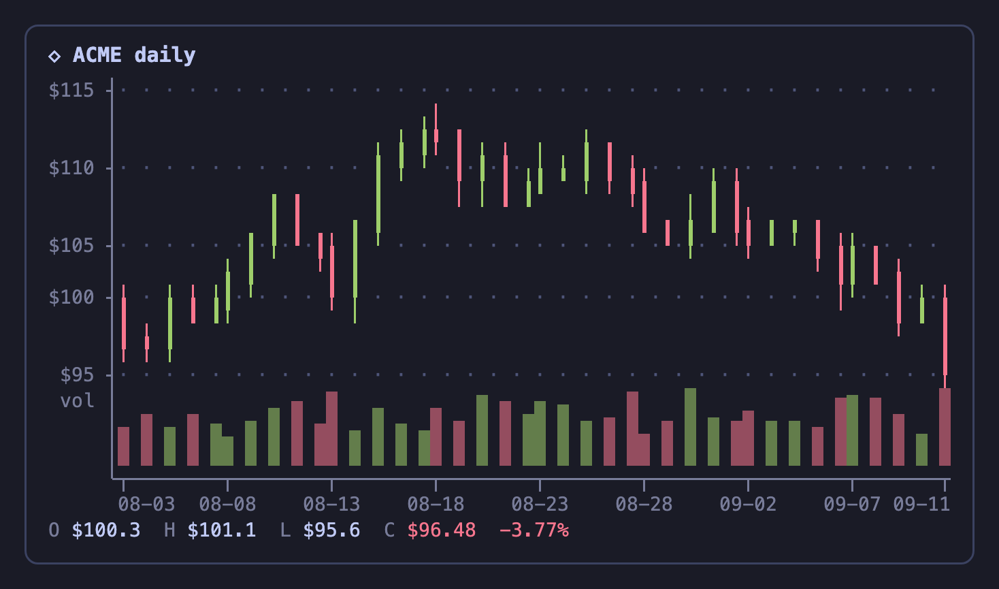<br><sub><code>candle + volume</code></sub></td><td width="50%">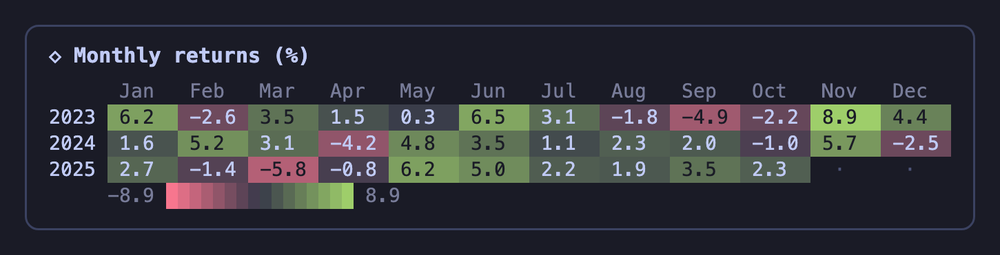<br><sub><code>heat (diverging)</code></sub></td></tr>
<tr><td width="50%">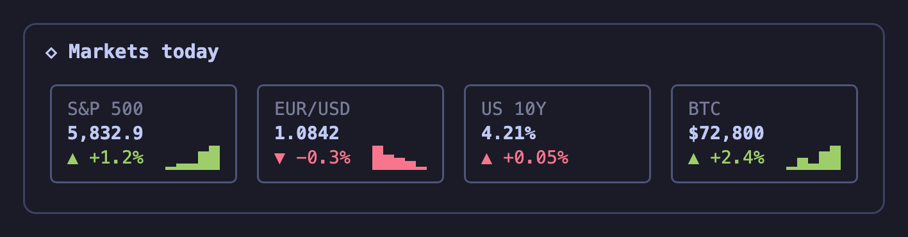<br><sub><code>stat (KPI tiles)</code></sub></td><td width="50%">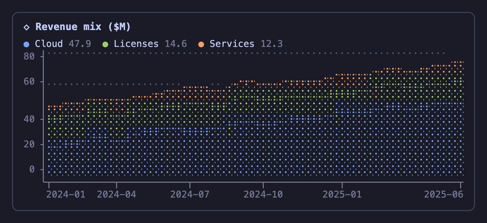<br><sub><code>area, stacked</code></sub></td></tr>
<tr><td width="50%">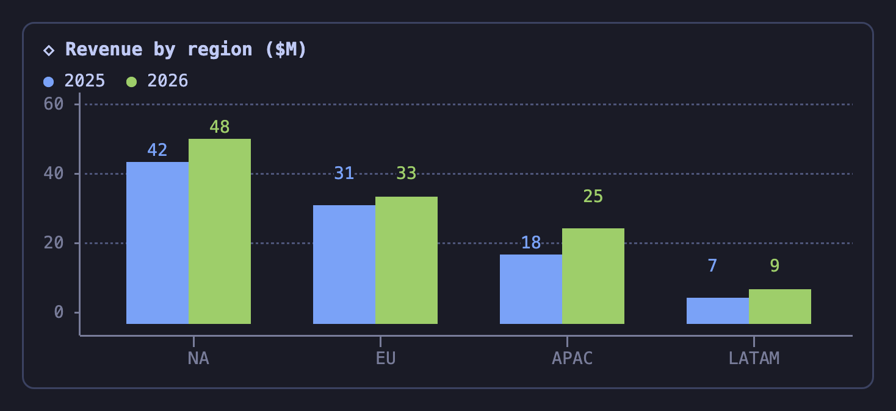<br><sub><code>column, grouped</code></sub></td><td width="50%">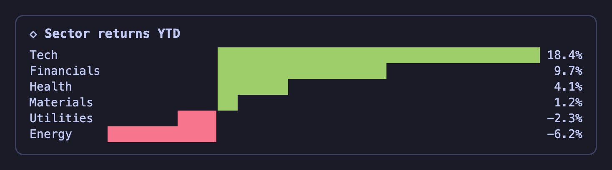<br><sub><code>bar, diverging</code></sub></td></tr>
<tr><td width="50%">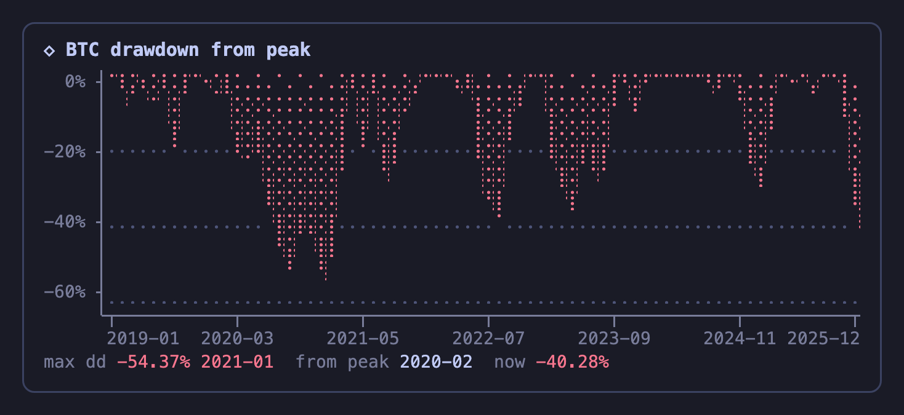<br><sub><code>drawdown</code></sub></td><td width="50%">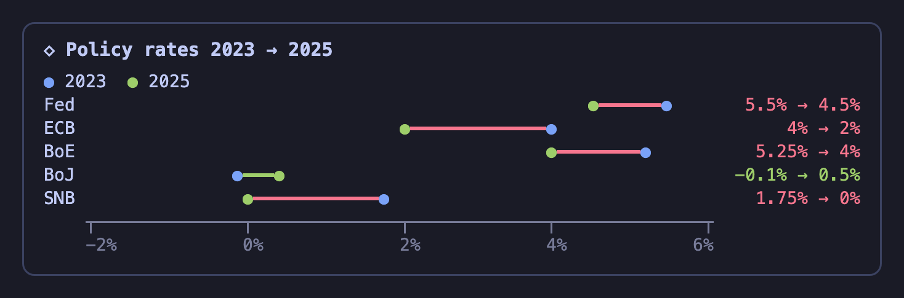<br><sub><code>dumbbell</code></sub></td></tr>
<tr><td width="50%">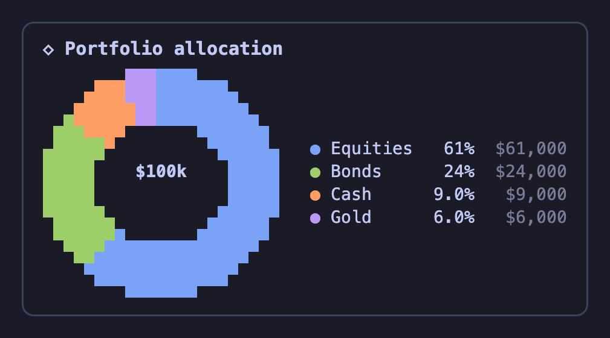<br><sub><code>donut</code></sub></td><td width="50%">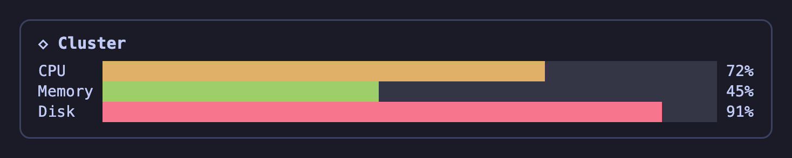<br><sub><code>gauge</code></sub></td></tr>
<tr><td width="50%">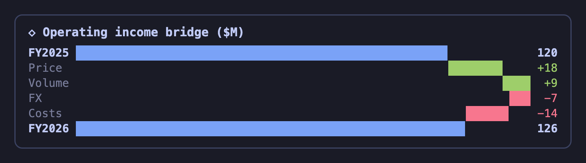<br><sub><code>waterfall</code></sub></td><td width="50%">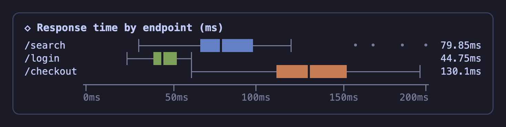<br><sub><code>box</code></sub></td></tr>
<tr><td width="50%">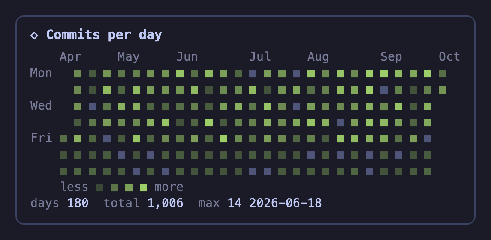<br><sub><code>calendar</code></sub></td><td width="50%">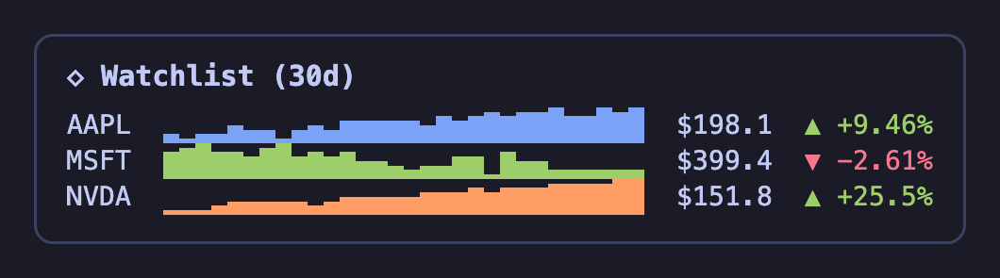<br><sub><code>spark (watchlist)</code></sub></td></tr>
<tr><td width="50%">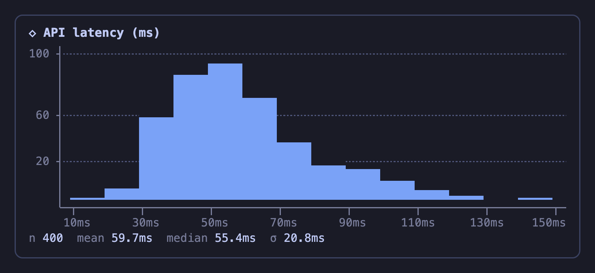<br><sub><code>hist</code></sub></td><td width="50%">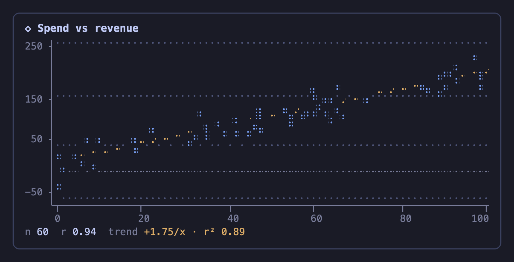<br><sub><code>scatter + trend</code></sub></td></tr>
<tr><td width="50%">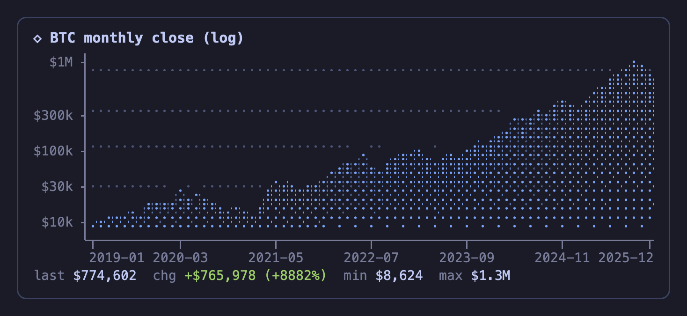<br><sub><code>area, log scale</code></sub></td><td width="50%">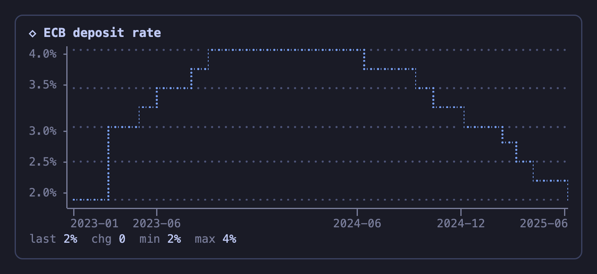<br><sub><code>step</code></sub></td></tr>
<tr><td width="50%">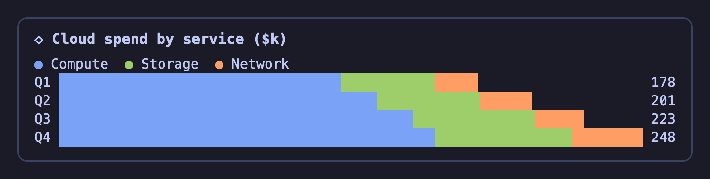<br><sub><code>bar, stacked</code></sub></td><td width="50%">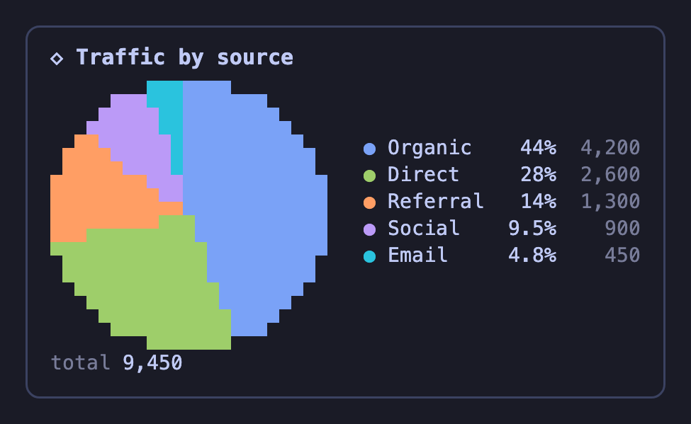<br><sub><code>pie</code></sub></td></tr>
</table>

### Forgiving input

Models don't always write tidy JSON, so the parser accepts a lot:

- JSON with comments, trailing commas, single quotes, bare keys, or `NaN`
- data as `[label, value]` pairs, bare numbers, `{label: value}` maps, objects with common keys (`date`/`value`, `x`/`y`, `close`…), `{"CPI":[…],"Core":[…]}` series maps, or Chart.js `{"labels","datasets"}`
- numeric strings such as `"4.1"`, `"1,234"` or `"12%"`
- type aliases: `heatmap`, `candlestick`, `ohlc`, `histogram`, `donut`, `meter`, `progress`, `bridge`, `sparkline`…
- non-JSON blocks: bare numbers (`4.1 4.2 4.0`), `label: value` lines, or CSV/TSV with a header row (one series per column)

While a block is still streaming in, the card shows a quiet `◇ chart · drawing…` placeholder instead of flashing a parse error. Only a finished block with a broken spec gets a red error card.

## Teaching the model

The plugin's server half (`index.ts`) appends a short cheat sheet (`prompt.ts`) to the system prompt. Every session therefore knows the chart types and data shapes, and you don't have to edit `AGENTS.md`. Turn it off with the plugin option `{ "prompt": false }`, and paste `CHART_PROMPT` from `prompt.ts` into your own instructions instead if you prefer.

## How it works

- `engine/` is the pure chart engine: spec in, rows of styled runs out. Each chart draws into a `CellGrid`, so it can never exceed the width it was given. The drawing surfaces are a `BrailleCanvas` (2×4 dots per cell, with layered colors so lines win over fills and grid), a `PixelCanvas` (half-block pixels with full color per pixel, used for pie charts) and fractional bars made of eighth blocks. Where two stacked segments meet inside one cell, the cell uses the lower segment as foreground and the upper one as background, so there's no visible gap.
- `render.ts` bridges to OpenTUI. Each chart becomes a single `TextRenderable` with `StyledText` content (foreground and background per run) inside a rounded card. The card measures its real width, which changes when the sidebar opens or the terminal is resized, and redraws the chart to fit. Narrow charts get a snug card.
- `tui.ts` is the TUI plugin entry. It registers the `chart` and `spark` languages and maps OpenCode's resolved theme tokens (`categorical`, `text`, `feedback`, `background`) onto the chart palette. It imports `@opentui/core` itself and passes the classes on to `render.ts`, because the host only swaps that import for its own runtime instance in the entry file. Renderables from a second copy of the library can't paint into the host's buffers.
- `index.ts` is the server plugin entry (prompt injection). It has no runtime imports.
- `claude-code/` is the Claude Code plugin (a hooks module). A `ui.render` hook on `AssistantMessage` splits each reply into markdown and chart blocks, draws the markdown with Claude Code's own `Markdown` element and each chart as rows of colored `Text`, and a `prompt.compose` hook adds the cheat sheet. A plugin may only import files from its own folder, so `bun scripts/sync-claude-mod.ts` copies `engine/` and `prompt.ts` into `claude-code/hooks/`; `--check` fails when the copy is stale.

Plugin options (`cli.json`): `maxWidth` (default 140), `languages` (default `["chart","spark"]`), `toast` (announce on load), `prompt` (default `true`).

## Development

```sh
bun install          # dev only: types, OpenTUI for the render tests
bun test             # engine tests + OpenTUI integration tests (headless renderer)
bun run typecheck
bun scripts/demo.ts [filter] [--width 80] [--light] [--plain] [--file spec.json]
bun scripts/screenshots.ts [filter]   # docs/screenshots/*.png (headless Chrome + ImageMagick)
bun scripts/promo.ts [out.mp4]        # 17 s promo video, 1080p H.264 (puppeteer-core + ffmpeg)
bun run sync:claude  # copy engine/ + prompt.ts into the Claude Code plugin
bun run test:claude  # check the copy is in sync, then `claude plugin test claude-code`
```

## License

MIT
